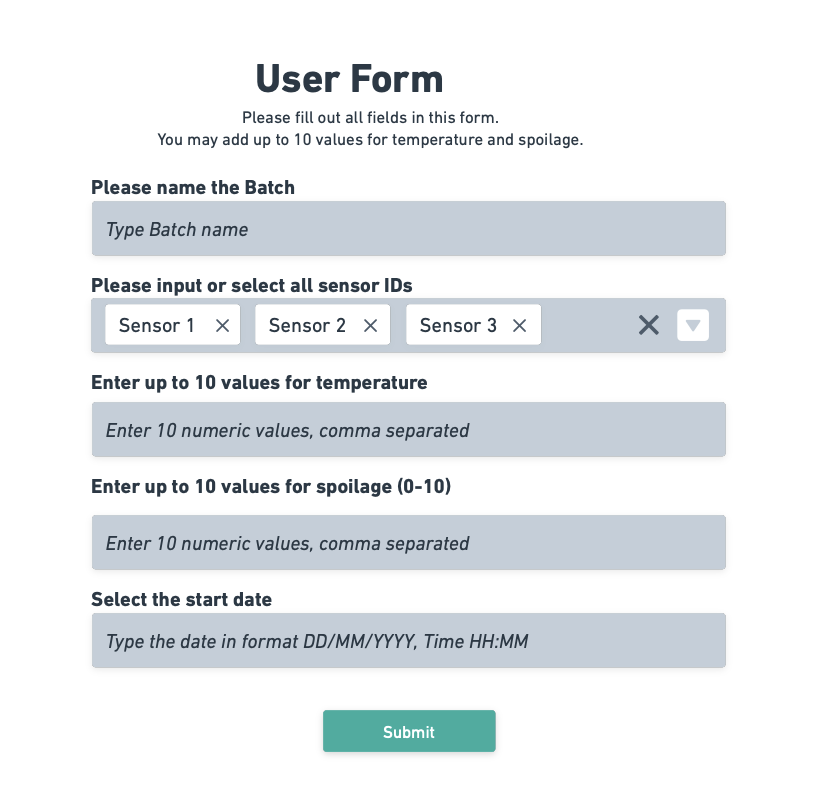
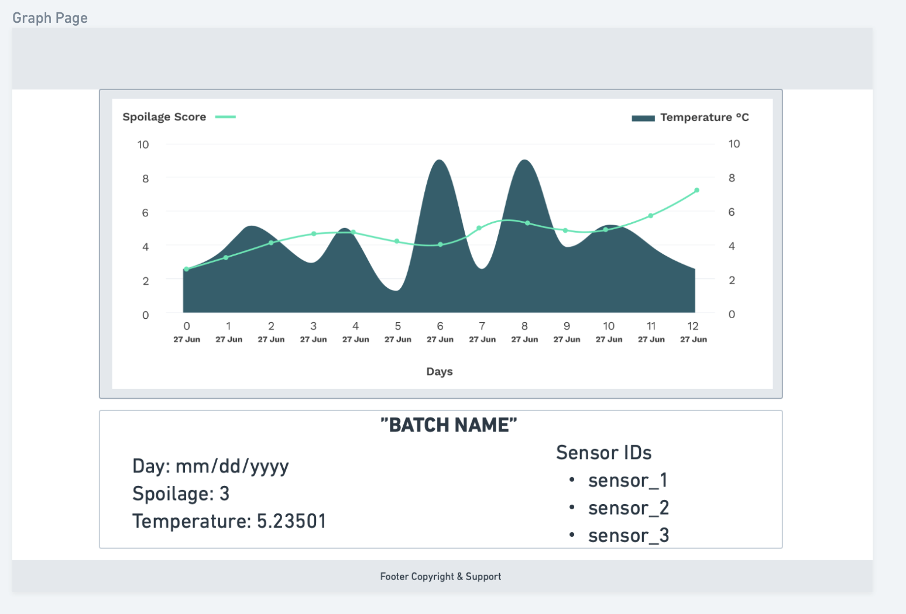

# Analytics Dashboard

This is a [Next.js](https://nextjs.org/) project generated by [`create-next-app`](https://github.com/vercel/next.js/tree/canary/packages/create-next-app).

### Install the necessary packages

1. Download [node](https://nodejs.org/en/download)
2. Install the Node Package Manager [npm](https://docs.npmjs.com/downloading-and-installing-node-js-and-npm)
3. Install [yarn via npm](https://classic.yarnpkg.com/lang/en/docs/install/#mac-stable)

### Prepare your local setup

1. Make sure `/usr/local/bin` is part of your `$PATH` with the following command: `echo $PATH | grep /usr/local/bin`. If this command doesn't show any output, try the suggestions on Stack Overflow to ["Add /usr/local/sbin to the PATH of a user"](https://superuser.com/questions/595818/add-usr-local-sbin-to-the-path-of-a-user) and modify to add **bin** to your PATH.
2. Run the command `yarn install` to install all dependencies for this project.
3. Build the TypeScript code with `npm run build`.
4. Run the server on your localhost: `npm run dev`.

## The Assignment

You are developing a client dashboard to monitor spoilage of food packages that have our sensors integrated.

**Your task**: Create a two-page app using React and NextJS, adding to the provided code.

**Page 1**: Client inputs temperature and spoilage data for multiple days using a form.

**Page 2**: Client can view spoilage and temperature data displayed as a graph using data from the previous form.

Provided is a low-fidelity wireframe of the form to assist you. You can use any plugins and libraries to assist with functionality of the form, and your final code may differ from the suggested design.

The form should take the following fields:

> * up to 10 sensor IDs per submission (sensor IDs may be repeated),
> * 10 numerical comma-separated values for spoilage (ranging from 0-10),
> * 10 comma-separated float values for temperature, correct to 5 decimal places,
> * 1 date value represeting when the batch starts,
> * 1 name for the batch.

When the user submits the form, they should be redirected to page 2 where the values for a batch are displayed graphically. We have included a low-fidelity wireframe for the graph page that you can use as inspiration, however your final design is allowed to deviate from our suggested design so long as the functionality is the same.

Below the graph, display a div with information about the graph including:

> * The name of the batch as a title,
> * Sensor IDs included in the batch, taken from the form,
> * Readings for temperature and spoilage per day.

The graph should display:

> * Spoilage values on the left y-axis,
> * Temperature values on the right y-axis,
> * The x-axis should show date values from when the batch starts and continue for 10 days,

To extend the design, add a tooltip when the user mouses over or clicks a point on the graph so they can see the sensor IDs included in the batch, or change the information displayed dynamically in the div below the graph.

For styling we recommend [Tailwind CSS](https://tailwindcss.com/docs/installation). For creating the chart, you can use [recharts](https://recharts.org/en-US/examples) to create a Composed Chart or any other suitable graphing library.

### Low Fidelity Designs

---

**User Form**



---

**Graph Page**



---

### Technical details

1. Modify `src/app/page.tsx` to create a form where users can enter values in the following format:

    ```typescript
        oneValue = {
            test_day: 'Day 1',
            temperature: 6.00001,
            spoilage: 10,
            sensor_ids: ['sensor_1', 'sensor_2', 'sensor_3'],
        }
    ```

   1. Users should be able to submit the form multiple times to create multiple graphs.
   2. `test_day` should be unique and count from the date field the user inputs in the form.
   3. Spoilage should be a numerical value ranging from 0-10.
   4. Temperature values should be floats correct to 5 decimal places.

2. Modify `src/pages/display-graph.tsx` to use the data from the form above. Create a graph displaying these values as described above and shown in the included low-fidelity wireframe. You may use [recharts](https://recharts.org/en-US/examples) to create a Composed Chart or any other suitable graphing library for this step.

## Submitting your code

Deployment is not necessary as part of this exercise, but please make sure that any packages you install are included in `package.json` and running `npm run build && npm run dev` accurately shows your code changes on localhost so that we can review your work.

Please share a link to the github repo where all of your code is available via email.

Please document your work in the form of comments or by adding to this README directly. We will be looking for accuracy and completeness of your solution, as well as clean front-end styling. You may use plugins and libraries to assist with functionality of the form and graphs, and your final code may differ visually from the suggested design.

We will verify the front-end visuals by cloning your work, then running `npm run build && npm run dev` to view the result of your assignment on [http://localhost:3000](http://localhost:3000).

## Resources

To read more about Next.js, Tailwind CSS, and React, take a look at the following resources:

* [Next.js Documentation](https://nextjs.org/docs) - learn about Next.js features and API.
* [Learn Next.js](https://nextjs.org/learn) - an interactive Next.js tutorial.
* [Tailwind CSS docs](https://tailwindcss.com/docs/installation).
* [Start a new React project](https://react.dev/learn/start-a-new-react-project).
